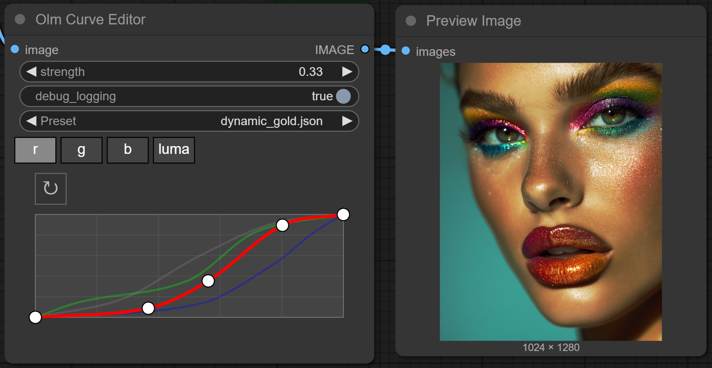

# Olm Curve Editor for ComfyUI

A single-purpose, multi-channel curve editor for ComfyUI, providing precise color control over R, G, B, and Luma channels directly within the node graph.

It’s a focused, lightweight, and standalone solution built specifically for one task: applying color curves cleanly and efficiently.



- **Author:** Olli Sorjonen
- **GitHub:** [https://github.com/o-l-l-i](https://github.com/o-l-l-i)
- **X:** [https://x.com/Olmirad](https://x.com/Olmirad)
- **Version:1.0.0**

---

## ✨ What Is This?

This is a custom node for [ComfyUI](https://github.com/comfyanonymous/ComfyUI) that adds interactive, curve-based color adjustment. It’s designed for fast, responsive fine-tuning of image tones via an intuitive interface, much like traditional color grading tools in photo editors.

You can switch between RGB and Luma channels, edit their curves independently, and immediately preview the results in your ComfyUI workflow by evaluating the graph. The curve adjustment effects are applied to images relatively fast (within seconds) so you can use this on 4k+ images.

---

## 🔧 Features

- 🎚️ **Editable Curve Graph**
  - Realtime editing and visualization of the curves.
  - Enforces clamping of endpoints at 0 and 1.
  - Custom curve type which avoids overshoots.
- 🖱️ **Smooth UX**
  - Click to add, drag to move, shift-click to remove points.
- 🎨 **Channel Tabs**
  - R, G, B, and Luma curves with independent data.
- 🔁 **Reset Button**
  - Per-channel reset to default linear curve.
- 📤 **Auto-Serialization**
  - Curve values are saved as JSON and sent to the backend.
- 🖼️ **Presets**
  - Comes with 20 presets, you can also create your own.
  - loaded from **curve_presets** folder within the node's folder.

---

## Installation

1. **Clone this repository to your ComfyUI/custom_nodes folder.**

```bash
git clone https://github.com/o-l-l-i/ComfyUI-Olm-CurveEditor.git
```

Your folder structure should look like:

```
ComfyUI/
└── custom_nodes/
└──── ComfyUI-Olm-CurveEditor/
├──── __init__.py
├──── olm_curve_editor.py
└──── curve_presets
└────── <presets are here>
```


2. **Check/install dependencies.**

You should already have all of the dependencies installed if you have ComfyUI up and running.
Remember to always active the virtual environment (venv) before installing anything.

```bash
# Most likely you don't need to do this:
pip install -r requirements.txt
```

Restart ComfyUI after installation.

---

## 🧪 Basic Usage

1. Add the **Olm Curve Editor** from the node or search node menu in ComfyUI.
2. Click tabs to switch between R, G, B, and Luma channels.
3. Left-click to add a new point on the curve.
4. Drag existing points to reshape the curve.
5. **Shift-click** to remove a point (minimum of 2 points always remain).
6. Use the **Reset** button to restore the selected channel's default.
7. Evaluate graph to test the effects of curve adjustment.

---

## 🧠 How to Create Presets

- Presets are in curve_presets folder within this custom node's folder.
- You can easily create your own presets:
  - Adjust curves to your liking.
  - Enable debugging mode in the UI to get printouts to the console.
  - Copy the printed JSON data to a <filename>.json file, and put the file to curve_presets within the node's folder.
  - Refresh ComfyUI's frontend, and the new preset you created should appear to the dropdown.

---

## 📌 Known Limitations

- No built-in undo/redo support (yet, but ComfyUI's undo works quite OK).
- Max points per curve is limited (to prevent chaos).
- Basic UI layout; might feel cramped at times, but you can zoom in closer on the node canvas.
- Curves are linear-interpolated - no Bezier smoothing yet.
- Reset applies only per-channel, not globally.

---

## Notes

This is a personal learning project (v1), created to explore custom node development in ComfyUI. While I took care to ensure it functions properly and it has functioned fine in my own use, there may still be bugs, rough edges, or unexpected behavior - so use with caution.

Feedback is welcome! Feel free to open an issue if you encounter a problem or have suggestions or ideas to improve the node.

---

## Author

Created by [@o-l-l-i](https://github.com/o-l-l-i)